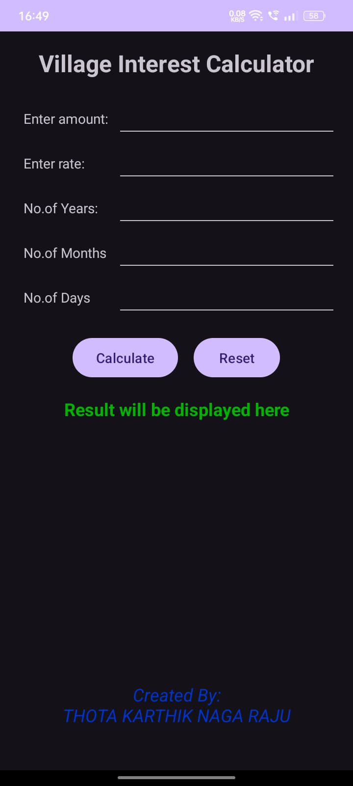
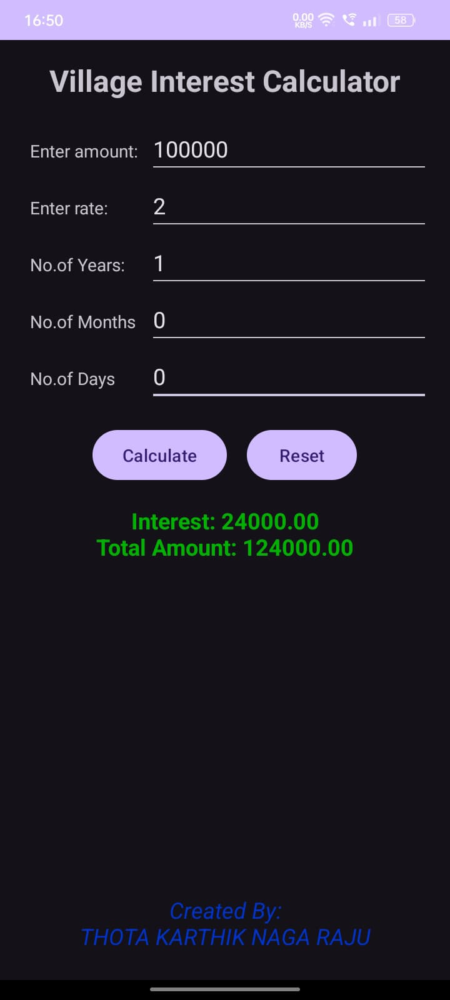

# 📱 Village Interest Calculator App 💰

Welcome to the **Village Interest Calculator App**! A simple and powerful Android mobile application that helps users calculate simple interest with ease. 📲

## 🏆 About the Project

This mobile app is developed using **Android Studio** and **Java**. It is specially designed to help users — especially in rural areas — calculate interest based on:

- 💵 **Amount (Principal)**  
- 📈 **Rate of Interest**  
- 🕒 **Time (Years / Months / Days)**  
- 🧮 **Calculate Button to Get Results**  

## 📌 Key Features

✅ **User-Friendly Interface** – Clean layout and easy navigation.  
✅ **Flexible Time Options** – Supports input in years, months, or days.  
✅ **Accurate Interest Calculation** – Get both interest and total amount.  
✅ **Instant Results** – Tap the calculate button to view your result immediately.  

## ⚙️ Tech Stack

- 👉 **Java**  
- 👉 **XML (Layout Design)**  
- 👉 **Android Studio**  

## 🌟 Why Use This App?

Perfect for shopkeepers, small business owners, students, and anyone who needs to calculate interest quickly and efficiently — especially in rural villages or local communities. 📍

## 📲 How to Use

1. Clone the repository:  
git clone https://github.com/karthiknagarajut/VillageIntrestMobileApp.git
2. Open the project in **Android Studio**.  
3. Run the app on your Android device or emulator.  
4. Enter the **amount**, **rate**, and **time**, then click **Calculate** to view results. 🎯

## 📸 Screenshots

### 🏠 Home • 🧾 Input • 📊 Result

  
  
  

## 💬 https://www.linkedin.com/in/karthiknagarajut/

For any queries or contributions, feel free to reach out! 📩  
**Thota Karthik Naga Raju**  
B.Tech - Computer Science and Engineering  
Bapatla Engineering College
